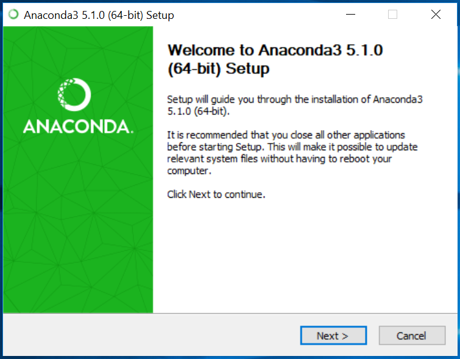
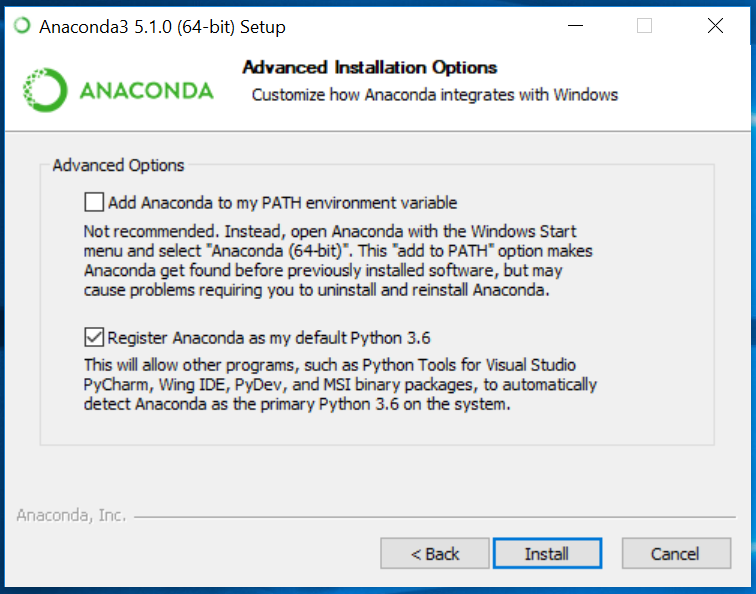
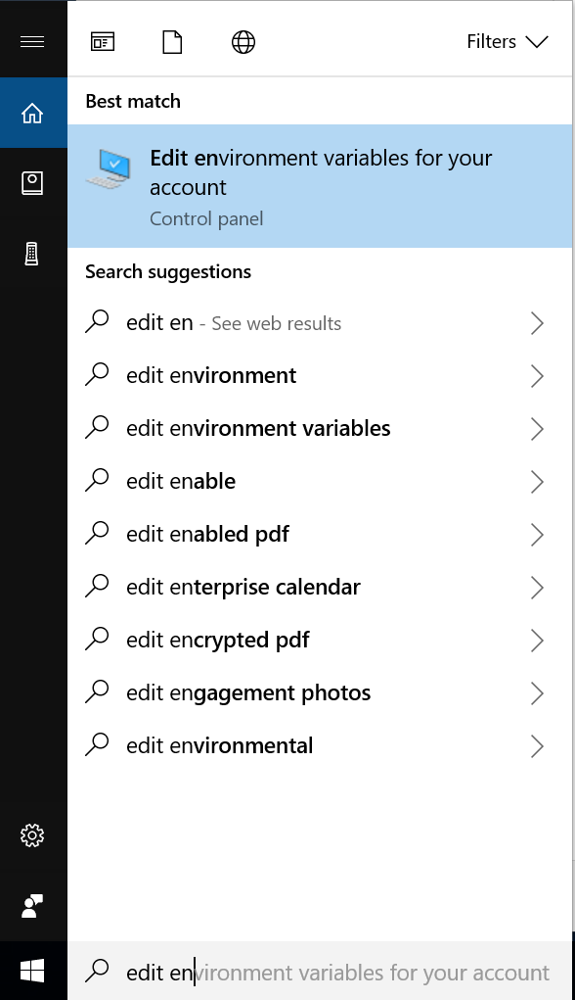
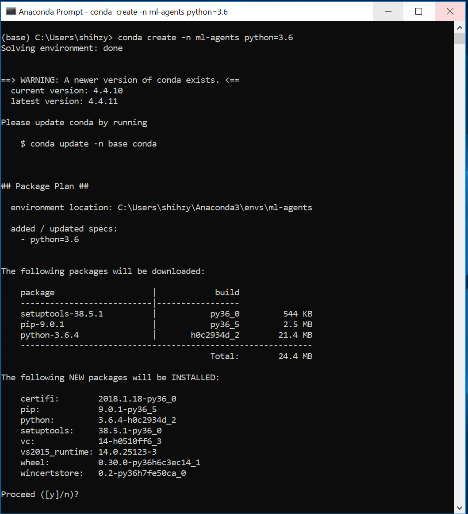
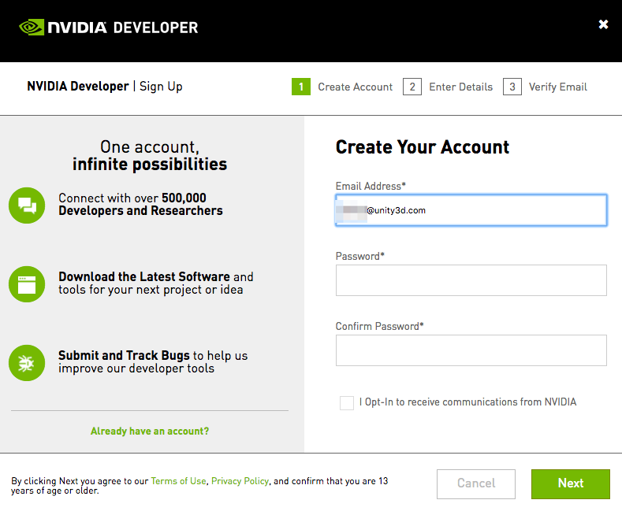
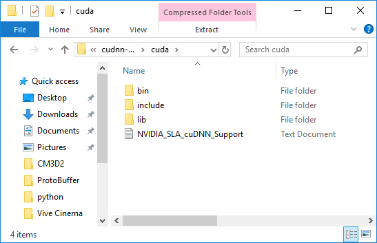
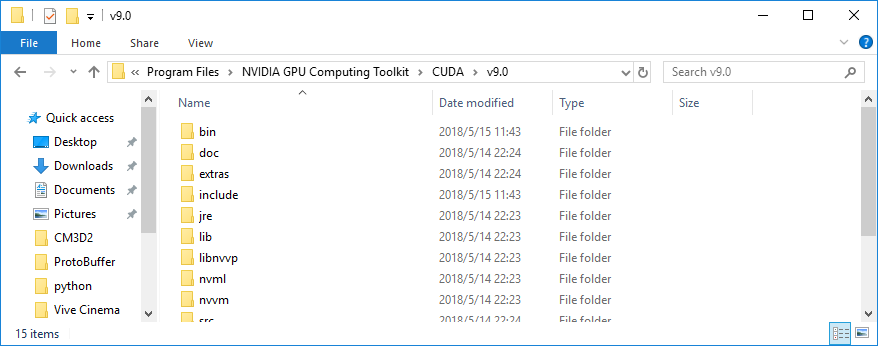
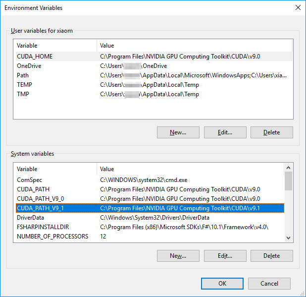
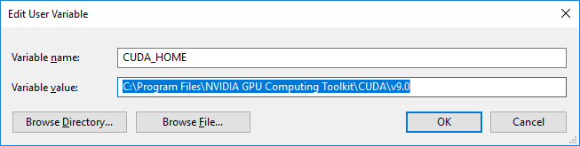
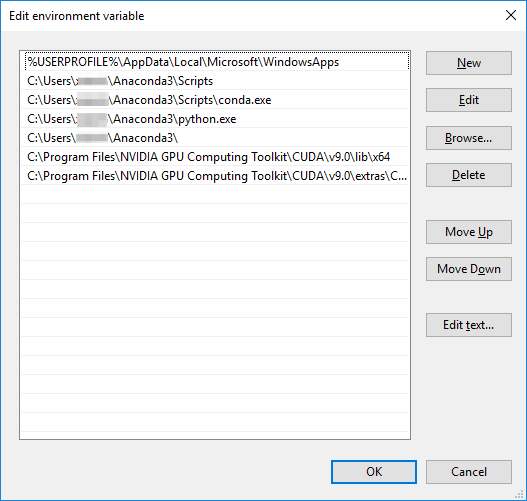

# Windows를 위한 ML-Agents Toolkit 설치

ML-Agents toolkit은 Windows 10을 지원한다. 다른 버전의 윈도우에서 ML-Agent toolkit이 실행될 수도 있지만 정상적으로 실행되는지 test해보진 않았다. 또한 Bootcamp와 Parallels(Bootcamp와 Parallels 모두 맥의 OS X에 Windows를 실행할 수 있게 해주는 가상머신이다.)와 같은 Windows VM에서도 테스트 되지 않았다.

ML-Agents toolkit을 사용하기 위해서는 아래 설명한 대로 Python과 필요한 Python package들을 설치해야 한다. 이 가이드 문서는 GPU를 이용한 학습을 위한 설치 방법도 포함하고 있다 (고급 유저를 위해서). GPU를 이용한 학습은 현재 ML-agents toolkit에는 필요하지 않지만, 앞으로 나올 버전과 기능에서는 필요할 수도 있다.

## Step 1: Anaconda를 통한 Python 설치

Windows용 Anaconda를 [다운로드](https://www.anaconda.com/download/#windows) 하고 설치한다. 아나콘다를 이용하여 다른 배포 버전의 Python을 분리된 환경으로 관리할 수 있다. ML-Agents toolkit은 더 이상 Python 2를 지원하지 않으며, ML-Agents toolkit을 사용하기 위해선 Python 3.5나 3.6이 필요하다. 이 가이드 문서에서는 Python 3.6 버전과 Anaconda 5.1을 이용한다.
([64-bit](https://repo.continuum.io/archive/Anaconda3-5.1.0-Windows-x86_64.exe)
또는 [32-bit](https://repo.continuum.io/archive/Anaconda3-5.1.0-Windows-x86.exe)
를 바로 다운 받으려면 링크를 클릭).

<p align="center">
  
</p>

Anaconda를 설치할때, 기본 옵션을 이용하여 설치하는 것을 추천한다. 하지만, 특수한 상황의 경우 적절한 옵션을 선택하여 Anaconda를 설치한다.

<p align="center">
  
</p>

After installation, you must open __Anaconda Navigator__ to finish the setup.
From the Windows search bar, type _anaconda navigator_. You can close Anaconda
Navigator after it opens.

If environment variables were not created, you will see error "conda is not
recognized as internal or external command" when you type `conda` into the
command line. To solve this you will need to set the environment variable
correctly.

Type `environment variables` in the search bar (this can be reached by hitting
the Windows key or the bottom left Windows button). You should see an option
called __Edit the system environment variables__.

<p align="center">
  
</p>

From here, click the __Environment Variables__ button. Double click "Path" under
__System variable__ to edit the "Path" variable, click __New__ to add the
following new paths.

```console
%UserProfile%\Anaconda3\Scripts
%UserProfile%\Anaconda3\Scripts\conda.exe
%UserProfile%\Anaconda3
%UserProfile%\Anaconda3\python.exe
```

## Step 2: Setup and Activate a New Conda Environment

You will create a new [Conda environment](https://conda.io/docs/) to be used
with the ML-Agents toolkit. This means that all the packages that you install
are localized to just this environment. It will not affect any other
installation of Python or other environments. Whenever you want to run
ML-Agents, you will need activate this Conda environment.

To create a new Conda environment, open a new Anaconda Prompt (_Anaconda Prompt_
in the search bar) and type in the following command:

```sh
conda create -n ml-agents python=3.6
```

You may be asked to install new packages. Type `y` and press enter _(make sure
you are connected to the Internet)_. You must install these required packages.
The new Conda environment is called ml-agents and uses Python version 3.6.

<p align="center">
  
</p>

To use this environment, you must activate it. _(To use this environment In the
future, you can run the same command)_. In the same Anaconda Prompt, type in the
following command:

```sh
activate ml-agents
```

You should see `(ml-agents)` prepended on the last line.

Next, install `tensorflow`. Install this package using `pip` - which is a
package management system used to install Python packages. Latest versions of
TensorFlow won't work, so you will need to make sure that you install version
1.7.1. In the same Anaconda Prompt, type in the following command _(make sure
you are connected to the Internet)_:

```sh
pip install tensorflow==1.7.1
```

## Step 3: Install Required Python Packages

The ML-Agents toolkit depends on a number of Python packages. Use `pip` to
install these Python dependencies.

If you haven't already, clone the ML-Agents Toolkit Github repository to your
local computer. You can do this using Git ([download
here](https://git-scm.com/download/win)) and running the following commands in
an Anaconda Prompt _(if you open a new prompt, be sure to activate the ml-agents
Conda environment by typing `activate ml-agents`)_:

```sh
git clone https://github.com/Unity-Technologies/ml-agents.git
```

If you don't want to use Git, you can always directly download all the files
[here](https://github.com/Unity-Technologies/ml-agents/archive/master.zip).

The `UnitySDK` subdirectory contains the Unity Assets to add to your projects.
It also contains many [example environments](Learning-Environment-Examples.md)
to help you get started.

The `ml-agents` subdirectory contains a Python package which provides deep reinforcement 
learning trainers to use with Unity environments.

The `ml-agents-envs` subdirectory contains a Python API to interface with Unity, which
the `ml-agents` package depends on. 

The `gym-unity` subdirectory contains a package to interface with OpenAI Gym.

Keep in mind where the files were downloaded, as you will need the 
trainer config files in this directory when running `mlagents-learn`.
Make sure you are connected to the Internet and then type in the Anaconda
Prompt:

```console
pip install mlagents
```

This will complete the installation of all the required Python packages to run
the ML-Agents toolkit.

Sometimes on Windows, when you use pip to install certain Python packages, the pip will get stuck when trying to read the cache of the package. If you see this, you can try:

```console
pip install mlagents --no-cache-dir
```

This `--no-cache-dir` tells the pip to disable the cache.  

### Installing for Development

If you intend to make modifications to `ml-agents` or `ml-agents-envs`, you should install 
the packages from the cloned repo rather than from PyPi. To do this, you will need to install
 `ml-agents` and `ml-agents-envs` separately. 
 
In our example, the files are located in `C:\Downloads`. After you have either
cloned or downloaded the files, from the Anaconda Prompt, change to the ml-agents
subdirectory inside the ml-agents directory:

```console
cd C:\Downloads\ml-agents
```
 
From the repo's main directory, now run:

```console
cd ml-agents-envs
pip install -e .
cd ..
cd ml-agents
pip install -e .
```

Running pip with the `-e` flag will let you make changes to the Python files directly and have those
reflected when you run `mlagents-learn`. It is important to install these packages in this order as the
`mlagents` package depends on `mlagents_envs`, and installing it in the other 
order will download `mlagents_envs` from PyPi. 

## (Optional) Step 4: GPU Training using The ML-Agents Toolkit

GPU is not required for the ML-Agents toolkit and won't speed up the PPO
algorithm a lot during training(but something in the future will benefit from
GPU). This is a guide for advanced users who want to train using GPUs.
Additionally, you will need to check if your GPU is CUDA compatible. Please
check Nvidia's page [here](https://developer.nvidia.com/cuda-gpus).

Currently for the ML-Agents toolkit, only CUDA v9.0 and cuDNN v7.0.5 is supported.

### Install Nvidia CUDA toolkit

[Download](https://developer.nvidia.com/cuda-toolkit-archive) and install the
CUDA toolkit 9.0 from Nvidia's archive. The toolkit includes GPU-accelerated
libraries, debugging and optimization tools, a C/C++ (Step Visual Studio 2017)
compiler and a runtime library and is needed to run the ML-Agents toolkit. In
this guide, we are using version
[9.0.176](https://developer.nvidia.com/compute/cuda/9.0/Prod/network_installers/cuda_9.0.176_win10_network-exe)).

Before installing, please make sure you __close any running instances of Unity
or Visual Studio__.

Run the installer and select the Express option. Note the directory where you
installed the CUDA toolkit. In this guide, we installed in the directory
`C:\Program Files\NVIDIA GPU Computing Toolkit\CUDA\v9.0`

### Install Nvidia cuDNN library

[Download](https://developer.nvidia.com/cudnn) and install the cuDNN library
from Nvidia. cuDNN is a GPU-accelerated library of primitives for deep neural
networks. Before you can download, you will need to sign up for free to the
Nvidia Developer Program.

<p align="center">
  
</p>

Once you've signed up, go back to the cuDNN
[downloads page](https://developer.nvidia.com/cudnn).
You may or may not be asked to fill out a short survey. When you get to the list
cuDNN releases, __make sure you are downloading the right version for the CUDA
toolkit you installed in Step 1.__ In this guide, we are using version 7.0.5 for
CUDA toolkit version 9.0
([direct link](https://developer.nvidia.com/compute/machine-learning/cudnn/secure/v7.0.5/prod/9.0_20171129/cudnn-9.0-windows10-x64-v7)).

After you have downloaded the cuDNN files, you will need to extract the files
into the CUDA toolkit directory. In the cuDNN zip file, there are three folders
called `bin`, `include`, and `lib`.

<p align="center">
  
</p>

Copy these three folders into the CUDA toolkit directory. The CUDA toolkit
directory is located at
`C:\Program Files\NVIDIA GPU Computing Toolkit\CUDA\v9.0`

<p align="center">
  
</p>

### Set Environment Variables

You will need to add one environment variable and two path variables.

To set the environment variable, type `environment variables` in the search bar
(this can be reached by hitting the Windows key or the bottom left Windows
button). You should see an option called __Edit the system environment
variables__.

<p align="center">
  
</p>

From here, click the __Environment Variables__ button. Click __New__ to add a
new system variable _(make sure you do this under __System variables__ and not
User variables_.

<p align="center">
  
</p>

For __Variable Name__, enter `CUDA_HOME`. For the variable value, put the
directory location for the CUDA toolkit. In this guide, the directory location
is `C:\Program Files\NVIDIA GPU Computing Toolkit\CUDA\v9.0`. Press __OK__ once.

<p align="center">
  
</p>

To set the two path variables, inside the same __Environment Variables__ window
and under the second box called __System Variables__, find a variable called
`Path` and click __Edit__. You will add two directories to the list. For this
guide, the two entries would look like:

```console
C:\Program Files\NVIDIA GPU Computing Toolkit\CUDA\v9.0\lib\x64
C:\Program Files\NVIDIA GPU Computing Toolkit\CUDA\v9.0\extras\CUPTI\libx64
```

Make sure to replace the relevant directory location with the one you have
installed. _Please note that case sensitivity matters_.

<p align="center">
    
</p>

### Install TensorFlow GPU

Next, install `tensorflow-gpu` using `pip`. You'll need version 1.7.1. In an
Anaconda Prompt with the Conda environment ml-agents activated, type in the
following command to uninstall TensorFlow for cpu and install TensorFlow
for gpu _(make sure you are connected to the Internet)_:

```sh
pip uninstall tensorflow
pip install tensorflow-gpu==1.7.1
```

Lastly, you should test to see if everything installed properly and that
TensorFlow can identify your GPU. In the same Anaconda Prompt, open Python 
in the Prompt by calling:

```sh
python
```

And then type the following commands:

```python
import tensorflow as tf

sess = tf.Session(config=tf.ConfigProto(log_device_placement=True))
```

You should see something similar to:

```console
Found device 0 with properties ...
```

## Acknowledgments

We would like to thank
[Jason Weimann](https://unity3d.college/2017/10/25/machine-learning-in-unity3d-setting-up-the-environment-tensorflow-for-agentml-on-windows-10/)
and
[Nitish S. Mutha](http://blog.nitishmutha.com/tensorflow/2017/01/22/TensorFlow-with-gpu-for-windows.html)
for writing the original articles which were used to create this guide.
